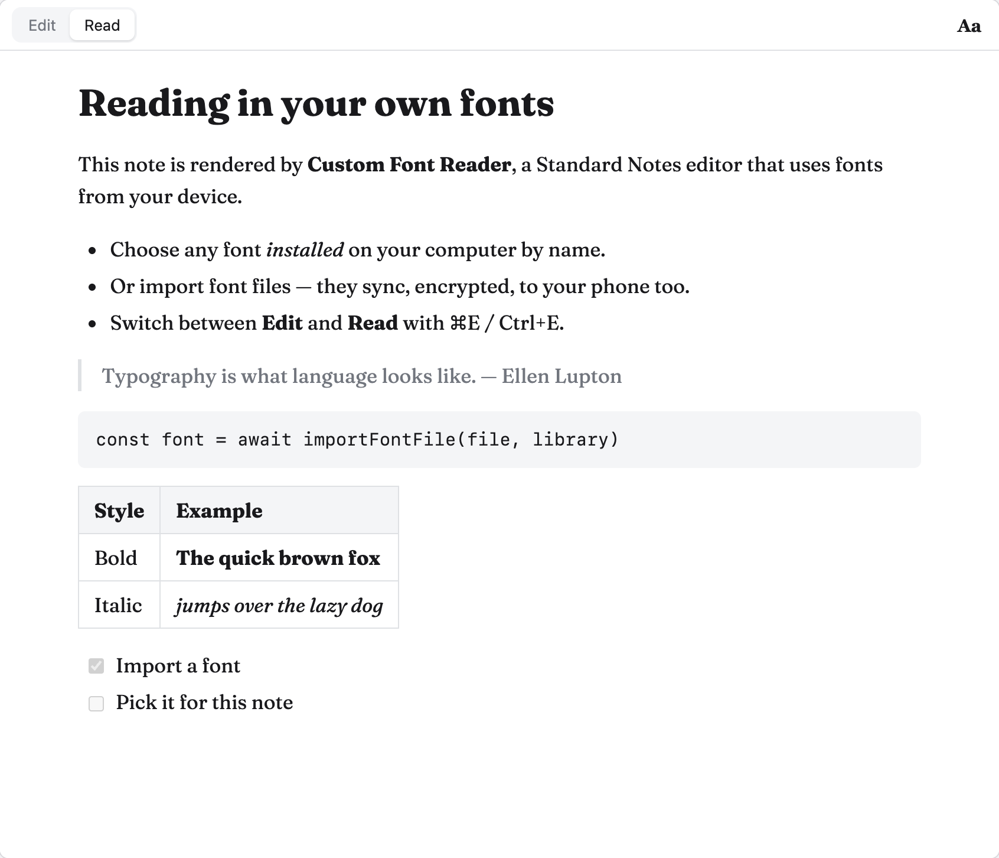
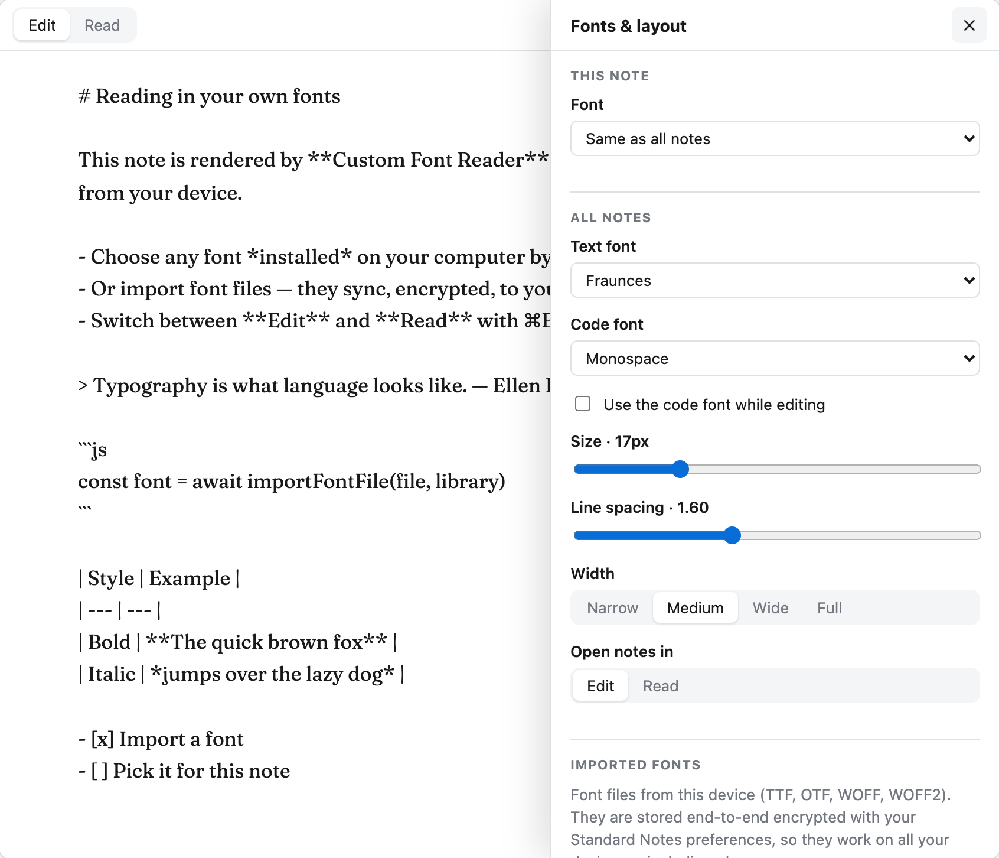

# Custom Font Reader for Standard Notes

A [Standard Notes](https://standardnotes.com) editor plugin that renders your notes in fonts from your own device:
fonts installed on your computer, or font files you import. Imported fonts sync end-to-end encrypted to all your
devices, phones included.



## Features

- **Edit** and **Read** views. Read renders Markdown (GitHub-flavored, single line breaks kept). Toggle with
  <kbd>⌘E</kbd> / <kbd>Ctrl+E</kbd>.
- **Installed fonts**: use any font installed on the device by name. The editor detects which popular fonts are
  installed and tells you whether a font is available on the current device.
- **Imported fonts**: TTF, OTF, WOFF and WOFF2 files. Family, weight, italic and variable-weight ranges are read
  from the font itself, so Regular/Bold/Italic files of a family group together and bold or italic text uses the
  real styles instead of synthesized ones.
- A text font for all notes, plus an optional font for an individual note.
- A code font for code in Read view, optionally also used while editing.
- Font size, line spacing, text width and the view notes open in.
- Follows the active Standard Notes theme, including dark themes.



## How "fonts from your device" work

|                     | Desktop app, Chrome, Edge, Firefox | Safari, iOS, Android           |
| ------------------- | ---------------------------------- | ------------------------------ |
| Installed fonts     | Any installed font, by name        | Only fonts that ship with the OS |
| Imported font files | Yes                                | Yes                            |

**Imported fonts** are stored in this plugin's data, which Standard Notes keeps in your synced, end-to-end
encrypted preferences. Standard Notes re-uploads those preferences whenever any preference changes, so the library
is capped at 3 MB (2 MB per file). TrueType and OpenType files are gzip-compressed before they are stored; WOFF2 files
are already the smallest, so prefer them for large fonts.

**Why fonts have to be added by name:** Standard Notes runs plugins in a sandboxed iframe without
`allow-same-origin`. That blocks the Local Font Access API, so a plugin cannot list installed fonts (and has no local
storage either). The editor suggests installed fonts by checking a list of popular ones, and any other installed font
can be added by typing its name.

## Install in Standard Notes

1. Host the build somewhere reachable over HTTPS (see [Deploy](#deploy)). The plugin manifest is `ext.json`, next
   to `index.html`.
2. In Standard Notes open **Preferences → Plugins → Install Custom Plugin**, paste the `ext.json` URL, choose
   **Install** and confirm.
3. Open a note, choose **Change note type → Custom Font Reader**. The first time, Standard Notes asks whether the
   plugin may access the current note; allow it.
4. Click **Aa** in the editor toolbar to choose fonts.

Switching a Super note to this editor converts it to Markdown (Standard Notes shows a conversion dialog first).
Switching back converts the Markdown to Super.

## Deploy

**GitHub Pages:** push the repository to GitHub and set **Settings → Pages → Source** to **GitHub Actions**.
`.github/workflows/deploy.yml` tests, builds and publishes on every push to `main`. The manifest URL is then
`https://<user>.github.io/<repo>/ext.json`.

**Any static host:** build with the URL the files will be served from, then upload `dist/`:

```sh
SN_PLUGIN_URL=https://example.com/standard-notes-reader/ npm run build
```

The URL is written into `ext.json`, which must be served with `Access-Control-Allow-Origin: *` (GitHub Pages does
this) because the web app downloads it from the browser. `SN_PLUGIN_URL` and `SN_PLUGIN_IDENTIFIER` can also go in a
`.env.production` file.

The build produces:

- `index.html`: the whole editor in one file, with a strict Content-Security-Policy.
- `ext.json`: the plugin manifest.
- `standard-notes-reader.zip`: downloaded by the desktop app so the editor works offline. The desktop app checks
  `ext.json` for updates, so bump `version` in `package.json` when you publish changes.

**Trying it locally:** `npm run build && npm run preview`, then install `http://localhost:4173/ext.json`. This is
easiest in the desktop app; browsers may block or ask permission before a website loads content from `localhost`.

## Development

```sh
npm install
npm run dev        # then open http://localhost:5173/harness.html
npm test           # unit tests and a production build check
npm run typecheck
```

`harness.html` stands in for Standard Notes. It hosts the editor in an iframe with the same sandbox flags as the app
and implements the host side of the plugin protocol. It includes sample notes, themes (including the app's real
Midnight theme), mobile messaging, locking and simulated edits from another device. Font files you put in
`harness/fonts/` (git-ignored) can be seeded into the plugin data. To test the production build in the harness, run
`npm run preview` and open `harness.html?editor=http://localhost:4173/index.html`.

| Path                           | What it does                                                         |
| ------------------------------ | -------------------------------------------------------------------- |
| `src/bridge/`                  | Standard Notes plugin protocol over `postMessage`                    |
| `src/fonts/`                   | Font file parsing, import, storage, registration and detection       |
| `src/note/`                    | What to save and when, merging outside changes, Markdown, previews   |
| `src/app/AppController.ts`     | Application state                                                    |
| `src/ui/`                      | Preact components and the stylesheet's theme hooks                   |
| `build/standardNotesPlugin.ts` | Single-file build, CSP, `ext.json` and the desktop zip               |
| `harness/`                     | The stand-in Standard Notes host                                     |

The editor talks to Standard Notes with its own small bridge instead of `@standardnotes/component-relay`. The npm
release of that package (2.2.2, from 2022) cannot post messages on mobile, where the app's origin is `null`, and does
not forward keyboard shortcuts. The bridge follows the protocol of relay 2.3.2, the version the app itself uses.

## Privacy and security

- The editor cannot make network requests (`connect-src 'none'`), and only its own, hash-pinned script can run.
- Rendered Markdown is sanitized with DOMPurify. Inline styles are removed so notes always use your fonts.
- Fonts stay inside Standard Notes' encrypted sync.

## Good to know

- Plugin data (settings and imported fonts) is read when a note opens. Changes made on another device show up the
  next time you open a note. If two devices change settings at the same moment, the last change wins.
- Font collections (`.ttc`) only load where the browser supports them; export a single style as `.ttf` or `.otf`.
- App shortcuts such as focus mode (<kbd>⌘⇧F</kbd>) work from inside the editor. Text-editing shortcuts
  (<kbd>⌘A</kbd>, <kbd>⌘⌫</kbd>, undo, copy and paste) stay in the editor, because Standard Notes would otherwise apply
  them to the whole app (<kbd>⌘⌫</kbd> moves the note to the trash).
